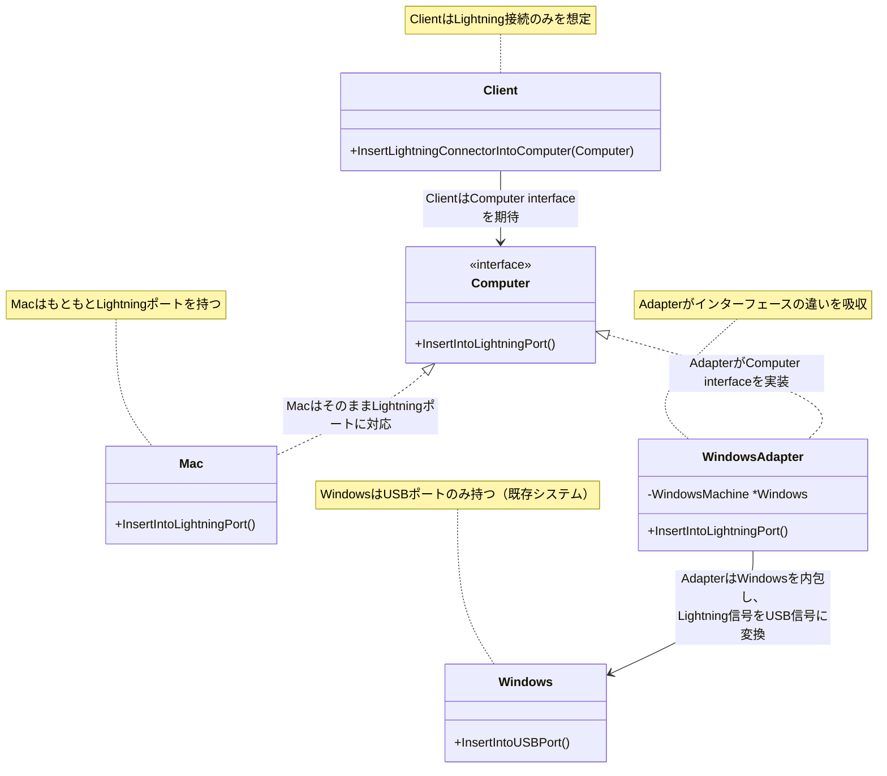
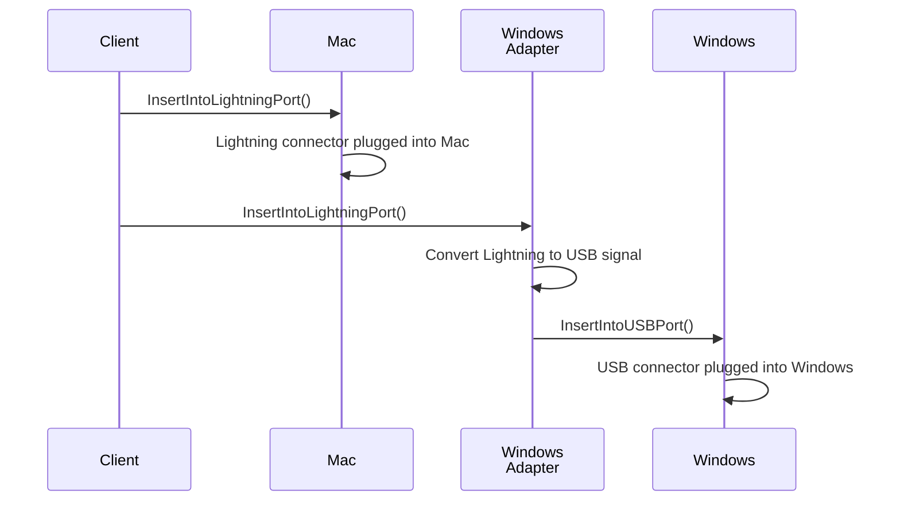

# Adapter パターン説明

## パターンの概要

Adapter（アダプター）パターンは、互換性のないインターフェースを持つクラス同士を協調させるための構造パターンです。  
このパターンにより、既存のクラスを変更することなく、異なるインターフェースを期待するクライアントコードと組み合わせて使用できます。

## パターンのポイント
- 既存のクラス（Adaptee）を変更せずに新しいインターフェース（Target）に適合させる
- Adapterが両者の間に立って、インターフェースの違いを吸収する
- Clientは統一されたインターフェースを通じて異なる実装を使用できる

## このサンプルの構造

このサンプルでは、コンピューターの接続ポート（Lightning vs USB）を題材にしたAdapter パターンの実装を行っています。

### 主要コンポーネント

1. **Target Interface（対象インターフェース）**: `Computer`
2. **Client（クライアント）**: `Client`
3. **Adaptee（被適応者）**: `Windows`（USBポートのみ対応）
4. **Adapter（適応者）**: `WindowsAdapter`（LightningをUSBに変換）
5. **Compatible Class（互換クラス）**: `Mac`（既にLightningポートに対応）

## クラス図



## シーケンス図



## 実装の詳細

### 1. Target Interface（Computer インターフェース）

```go
type Computer interface {
    InsertIntoLightningPort()
}
```

Clientが期待するインターフェースです。Lightning接続を前提としています。

### 2. Client（クライアント）

```go
type Client struct{}

func (c *Client) InsertLightningConnectorIntoComputer(com Computer) {
    fmt.Println("Client inserts Lightning connector into computer.")
    com.InsertIntoLightningPort()
}
```

ClientはLightning接続のみを想定し、`Computer`インターフェースを通じて操作します。

### 3. Compatible Class（Mac クラス）

```go
type Mac struct{}

func (m *Mac) InsertIntoLightningPort() {
    fmt.Println("Lightning connector is plugged into mac machine.")
}
```

MacはもともとLightningポートを持っているため、`Computer`インターフェースを直接実装できます。

### 4. Adaptee（Windows クラス）

```go
type Windows struct{}

func (w *Windows) InsertIntoUSBPort() {
    fmt.Println("USB connector is plugged into windows machine.")
}
```

WindowsはUSBポートのみを持つ既存システムです。Lightning接続には対応していません。

### 5. Adapter（WindowsAdapter クラス）

```go
type WindowsAdapter struct {
    WindowsMachine *Windows
}

func (w *WindowsAdapter) InsertIntoLightningPort() {
    fmt.Println("Adapter converts Lightning signal to USB.")
    w.WindowsMachine.InsertIntoUSBPort()
}
```

AdapterがLightning信号をUSB信号に変換し、WindowsマシンでもLightning接続を可能にします。

## パターンの利点

1. **既存コードの保護**: 既存のクラス（Windows）を変更する必要がない
2. **責任の分離**: 変換ロジックがAdapterに集約される
3. **再利用性**: 既存のクラスを新しい環境で再利用できる
4. **統一されたインターフェース**: Clientは一貫した方法で異なる実装を使用できる

## Adapterパターンが真価を発揮する場面

### 小規模な例での制限

このサンプルのような小規模なケースでは、Adapterパターンのメリットは限定的かもしれません。

```go
// 小規模なら直接条件分岐でも対応可能
func ConnectToComputer(computerType string) {
    switch computerType {
    case "mac":
        // Lightning接続
    case "windows":
        // USB接続
    }
}
```

### より現実的な場面での価値

#### **1. 外部ライブラリ・APIとの統合**

```go
// 既存の決済システム（変更不可能）
type LegacyPaymentSystem struct{}
func (l *LegacyPaymentSystem) ProcessPaymentOldFormat(amount float64, cardNumber string) bool {
    // 古い形式での決済処理
    return true
}

// 新しい決済インターフェース
type PaymentProcessor interface {
    ProcessPayment(request PaymentRequest) PaymentResponse
}

// アダプター
type LegacyPaymentAdapter struct {
    legacySystem *LegacyPaymentSystem
}

func (l *LegacyPaymentAdapter) ProcessPayment(request PaymentRequest) PaymentResponse {
    // 新しい形式を古い形式に変換
    success := l.legacySystem.ProcessPaymentOldFormat(
        request.Amount, 
        request.CreditCard.Number,
    )
    return PaymentResponse{Success: success}
}

// クライアントコード（変更なし）
func processOrder(processor PaymentProcessor, request PaymentRequest) {
    response := processor.ProcessPayment(request)
    // 統一されたインターフェースで処理
}
```

#### **2. データベースドライバの抽象化**

```go
// 既存のMySQLドライバ（サードパーティ製）
type MySQLConnection struct{}
func (m *MySQLConnection) ExecuteQuery(sql string) []map[string]interface{} {
    // MySQL固有の実装
    return nil
}

// 既存のPostgreSQLドライバ（サードパーティ製）
type PostgreSQLConnection struct{}
func (p *PostgreSQLConnection) RunQuery(query string, params []interface{}) []Row {
    // PostgreSQL固有の実装
    return nil
}

// 統一インターフェース
type DatabaseConnection interface {
    Query(sql string, args ...interface{}) ([]Record, error)
}

// MySQL用アダプター
type MySQLAdapter struct {
    conn *MySQLConnection
}

func (m *MySQLAdapter) Query(sql string, args ...interface{}) ([]Record, error) {
    // MySQLの結果を統一形式に変換
    rawResult := m.conn.ExecuteQuery(sql)
    return convertToRecords(rawResult), nil
}

// PostgreSQL用アダプター
type PostgreSQLAdapter struct {
    conn *PostgreSQLConnection
}

func (p *PostgreSQLAdapter) Query(sql string, args ...interface{}) ([]Record, error) {
    // PostgreSQLの結果を統一形式に変換
    rawResult := p.conn.RunQuery(sql, args)
    return convertRowsToRecords(rawResult), nil
}

// アプリケーションコード（データベースを意識しない）
func getUsersByAge(db DatabaseConnection, age int) []User {
    records, _ := db.Query("SELECT * FROM users WHERE age = ?", age)
    return convertRecordsToUsers(records)
}
```

#### **3. レガシーシステムとの統合**

```go
// 20年前のメインフレームシステム（変更不可能）
type MainframeSystem struct{}
func (m *MainframeSystem) EXEC_COBOL_PROGRAM(programName, inputData string) string {
    // COBOLプログラムの実行
    return "EXEC_RESULT"
}

// 現代のマイクロサービスインターフェース
type CustomerService interface {
    GetCustomerInfo(customerID string) (*Customer, error)
    UpdateCustomer(customer *Customer) error
}

// メインフレーム用アダプター
type MainframeCustomerAdapter struct {
    mainframe *MainframeSystem
}

func (m *MainframeCustomerAdapter) GetCustomerInfo(customerID string) (*Customer, error) {
    // 現代的なAPIをCOBOL呼び出しに変換
    input := fmt.Sprintf("GET_CUSTOMER:%s", customerID)
    result := m.mainframe.EXEC_COBOL_PROGRAM("CUSTINQ", input)
    
    // COBOLの結果を現代的なstructに変換
    return parseMainframeResponse(result), nil
}

func (m *MainframeCustomerAdapter) UpdateCustomer(customer *Customer) error {
    // structをCOBOL形式に変換
    input := formatForMainframe(customer)
    result := m.mainframe.EXEC_COBOL_PROGRAM("CUSTUPD", input)
    
    return checkMainframeError(result)
}

// 現代的なWebアプリケーション
func customerHandler(service CustomerService) http.HandlerFunc {
    return func(w http.ResponseWriter, r *http.Request) {
        // レガシーシステムを意識せずに使用
        customer, err := service.GetCustomerInfo(r.URL.Query().Get("id"))
        json.NewEncoder(w).Encode(customer)
    }
}
```

#### **4. 複数の外部サービスプロバイダー対応**

```go
// 異なるクラウドストレージプロバイダー
type AWSStorage struct{}
func (a *AWSStorage) UploadFileToS3(bucket, key string, data []byte) error {
    // AWS S3固有の実装
    return nil
}

type GoogleCloudStorage struct{}
func (g *GoogleCloudStorage) StoreObject(projectID, bucketName, objectName string, content []byte) error {
    // Google Cloud Storage固有の実装
    return nil
}

type AzureBlobStorage struct{}
func (a *AzureBlobStorage) CreateBlob(accountName, containerName, blobName string, payload []byte) error {
    // Azure Blob Storage固有の実装
    return nil
}

// 統一インターフェース
type CloudStorage interface {
    Upload(path string, data []byte) error
    Download(path string) ([]byte, error)
    Delete(path string) error
}

// 各プロバイダー用のアダプター
type AWSAdapter struct{ client *AWSStorage }
func (a *AWSAdapter) Upload(path string, data []byte) error {
    bucket, key := parsePath(path)
    return a.client.UploadFileToS3(bucket, key, data)
}

type GCPAdapter struct{ client *GoogleCloudStorage }
func (g *GCPAdapter) Upload(path string, data []byte) error {
    project, bucket, object := parseGCPPath(path)
    return g.client.StoreObject(project, bucket, object, data)
}

type AzureAdapter struct{ client *AzureBlobStorage }
func (a *AzureAdapter) Upload(path string, data []byte) error {
    account, container, blob := parseAzurePath(path)
    return a.client.CreateBlob(account, container, blob, data)
}

// アプリケーションコード（プロバイダーを意識しない）
func backupUserData(storage CloudStorage, userID string, data []byte) error {
    path := fmt.Sprintf("users/%s/backup.json", userID)
    return storage.Upload(path, data)
}

// 設定ベースでプロバイダー切り替え
func createCloudStorage(provider string) CloudStorage {
    switch provider {
    case "aws":
        return &AWSAdapter{client: &AWSStorage{}}
    case "gcp":
        return &GCPAdapter{client: &GoogleCloudStorage{}}
    case "azure":
        return &AzureAdapter{client: &AzureBlobStorage{}}
    default:
        panic("unsupported provider")
    }
}
```

#### **5. テスト環境での活用**

```go
// 本番環境での外部API
type EmailService struct{}
func (e *EmailService) SendEmail(to, subject, body string) error {
    // 実際にメール送信
    return sendToSMTPServer(to, subject, body)
}

// テスト用のモック
type MockEmailService struct {
    sentEmails []Email
}
func (m *MockEmailService) RecordEmail(to, subject, body string) {
    m.sentEmails = append(m.sentEmails, Email{to, subject, body})
}

// 統一インターフェース
type NotificationService interface {
    Send(to, subject, body string) error
}

// 本番用アダプター
type EmailAdapter struct{ service *EmailService }
func (e *EmailAdapter) Send(to, subject, body string) error {
    return e.service.SendEmail(to, subject, body)
}

// テスト用アダプター
type MockEmailAdapter struct{ mock *MockEmailService }
func (m *MockEmailAdapter) Send(to, subject, body string) error {
    m.mock.RecordEmail(to, subject, body)
    return nil  // テストでは常に成功
}

// アプリケーションコード（環境を意識しない）
func sendWelcomeEmail(notifier NotificationService, user *User) {
    notifier.Send(user.Email, "Welcome!", "Welcome to our service!")
}

// テスト
func TestSendWelcomeEmail(t *testing.T) {
    mockService := &MockEmailService{}
    adapter := &MockEmailAdapter{mock: mockService}
    
    user := &User{Email: "test@example.com"}
    sendWelcomeEmail(adapter, user)
    
    // メール送信をテスト
    assert.Equal(t, 1, len(mockService.sentEmails))
    assert.Equal(t, "Welcome!", mockService.sentEmails[0].Subject)
}
```

### 結論

小規模なサンプルでは**直接的な解決法**の方が簡単ですが、以下の場合にAdapter パターンの真価が発揮されます：

1. **既存システム統合**: 変更できないレガシーシステムとの連携
2. **外部ライブラリ**: サードパーティ製品の差異を吸収
3. **複数プロバイダー対応**: 異なるサービスプロバイダーの統一
4. **段階的移行**: 旧システムから新システムへの移行時
5. **テスト性**: 本番環境とテスト環境での切り替え

**既存のコードを変更できない状況**や**異なるインターフェースを統一したい場合**に特に威力を発揮するパターンです！
