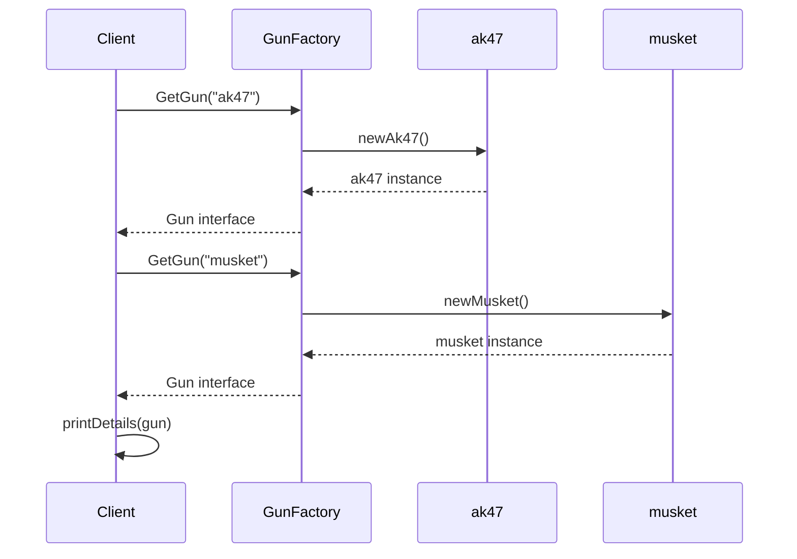

# Factory Method パターン説明

## パターンの概要

Factory Method（ファクトリーメソッド）パターンは、オブジェクトの生成を抽象化し、具体的なクラスの生成をサブクラスに委譲する生成パターンです。  
このパターンにより、クライアントコードは具体的なクラスを知ることなく、インターフェースを通じてオブジェクトを使用できます。

## パターンのポイント
- ClientはFactoryのみを呼び出し、具体的なクラスは知らない
- Factoryによって返される値はinterfaceによって抽象化されている

## このサンプルの構造

このサンプルでは、銃（Gun）を題材にしたFactory Methodパターンの実装を行っています。

### 主要コンポーネント

1. **Product Interface（製品インターフェース）**: `Gun`
2. **Concrete Products（具体的製品）**: `ak47`, `musket`
3. **Factory Function（ファクトリー関数）**: `GetGun()`
4. **Base Product（基底製品）**: `gun` struct

## クラス図

```mermaid
classDiagram
    %% Factory Method Pattern - Gun Example
    class Client {
        +main()
        +printDetails(Gun)
    }
    
    class Gun {
        <<interface>>
        +SetName(name string)
        +SetPower(power int)
        +GetName() string
        +GetPower() int
    }
    
    class gun {
        -name string
        -power int
        +SetName(name string)
        +SetPower(power int)
        +GetName() string
        +GetPower() int
    }
    
    class ak47 {
        +gun
    }
    
    class musket {
        +gun
    }
    
    class GunFactory {
        +GetGun(gunType string) Gun, error
    }
    
    Client --> GunFactory : ClientはFactoryを通じてGun interfaceを満たすstructの値を取得する
    Client --> Gun : ClientはFactoryがGun interfaceを返すことを知っている<br/>また、Gun interfaceに実装されたメソッドを呼び出す事ができる 
    Gun <|.. gun
    gun <|-- ak47
    gun <|-- musket
    GunFactory ..> Gun : GunFactoryはGun interfaceを満たすstructの値を返す
    GunFactory ..> ak47 : newAk47関数を通してak47のstructの値を返す
    GunFactory ..> musket : newMusket関数を通してmusketのstructの値を返す

    note for Client "ClientはあくまでFactoryとinterfaceにのみアクセスする"
    note for GunFactory "Factoryは受け取った引数に従ってどのクラスのインスタンスを生成するか決定する"
    note for gun ""
```

## シーケンス図



## 実装の詳細

### 1. Product Interface（Gun インターフェース）

```go
type Gun interface {
    SetName(name string)
    SetPower(power int)
    GetName() string
    GetPower() int
}
```

### 2. Base Product（gun 構造体）

```go
type gun struct {
    name string
    power int
}
```

gunは`Gun`インターフェースの基本実装を提供します。  
gunはak47とmusketの基底クラスのようなもので、これらの具体的な構造体に共通するメソッドやフィールドを持っています。  
これらの具体的な構造体にgunを埋め込むことで、共通するメソッドやフィールドを使用することができます。

### 3. Concrete Products（具体的製品）

- **ak47**: AK47銃を表現、パワー4
- **musket**: マスケット銃を表現、パワー1

両者とも`gun`構造体を埋め込み（embedding）により継承しています。

### 4. Factory Function（GetGun関数）

```go
func GetGun(gunType string) (Gun, error) {
    switch gunType {
    case "ak47":
        return newAk47(), nil
    case "musket":
        return newMusket(), nil
    default:
        return nil, fmt.Errorf("wrong gun type passed")
    }
}
```

引数に応じて具体的な構造体のインスタンスを返します。  
これらの構造体はGun interfaceを満たすように実装されています。

## パターンの利点

1. **緩い結合**: クライアントは具体的なクラスを知る必要がない
2. **拡張性**: 新しい銃の種類を追加しやすい
3. **カプセル化**: オブジェクト生成のロジックが一箇所に集約される
4. **型安全性**: インターフェースを通じた一貫した操作

## Factory Methodパターンが真価を発揮する場面

### 小規模な例での制限

小規模なケースでは、Factory Methodパターンの恩恵は分かりにくいかもしれません

```go
// 小規模なら直接呼び出しでも大差ない
ak47 := newAk47()
musket := newMusket()
rifle := newRifle()  // 新しく追加してもそんなに大変じゃない
```

### より現実的な場面での価値

#### **1. 設定ファイルによる動的生成**

```go
// config.json
{
    "defaultWeapons": ["ak47", "musket", "sniper"],
    "playerLevel": {
        "1": ["musket"],
        "10": ["ak47", "musket"],
        "20": ["ak47", "musket", "sniper", "rpg"]
    }
}

// 設定ベースでの生成
func loadPlayerWeapons(level int) []Gun {
    var weapons []Gun
    config := loadConfig()
    
    for _, weaponType := range config.PlayerLevel[level] {
        // ここでFactory使用 - 設定を変更するだけで武器変更可能
        weapon, err := GetGun(weaponType)
        if err != nil {
            continue
        }
        weapons = append(weapons, weapon)
    }
    return weapons
}
```

#### **2. 複数のクライアントで使用される場合**
以下のような場合に毎回具体的なクラスを生成すると、新しい銃の種類を追加する際にはクライアントコードをすべて変更する必要があります。

```go
// ゲームエンジン
func (g *GameEngine) SpawnWeapon(weaponType string) {
    weapon, _ := gun.GetGun(weaponType)  // Factory使用
    g.world.AddWeapon(weapon)
}

// インベントリシステム
func (i *Inventory) AddWeapon(weaponType string) {
    weapon, _ := gun.GetGun(weaponType)  // Factory使用
    i.weapons = append(i.weapons, weapon)
}

// AIシステム
func (ai *AIController) SelectWeapon(situation string) {
    weaponType := ai.determineOptimalWeapon(situation)
    weapon, _ := gun.GetGun(weaponType)  // Factory使用
    ai.currentWeapon = weapon
}

// ショップシステム  
func (s *Shop) PurchaseWeapon(playerID, weaponType string) {
    weapon, _ := gun.GetGun(weaponType)  // Factory使用
    s.transferToPlayer(playerID, weapon)
}
```

**新しい武器を追加した場合：**
- **Factory使用**: `GetGun()`に1つのcaseを追加するだけ
- **直接生成**: 4つのシステム全てを変更が必要

#### **3. テスト時の柔軟性**

```go
// テスト用のモック武器を簡単に作成
type mockGun struct {
    name string
    power int
}

func (m *mockGun) GetName() string { return m.name }
func (m *mockGun) GetPower() int { return m.power }
func (m *mockGun) SetName(name string) { m.name = name }
func (m *mockGun) SetPower(power int) { m.power = power }

// テスト用ファクトリー
func GetTestGun(gunType string) Gun {
    switch gunType {
    case "test":
        return &mockGun{name: "TestGun", power: 999}
    default:
        return GetGun(gunType) // 通常のファクトリーに委譲
    }
}
```

#### **4. 複雑な初期化ロジック**
以下のように各構造体で異なる初期化ロジックがあった場合にもfactoryの中にロジックを隠蔽することができます。
```go
func GetGun(gunType string) (Gun, error) {
    switch gunType {
    case "ak47":
        // 複雑な初期化処理
        ak47 := newAk47()
        
        // データベースから設定読み込み
        config := database.LoadWeaponConfig("ak47")
        ak47.SetPower(config.Power)
        
        // アタッチメント適用
        attachments := database.LoadAttachments("ak47")
        for _, attachment := range attachments {
            ak47.ApplyAttachment(attachment)
        }
        
        // ログ記録
        logger.Info("AK47 created with config", config)
        
        return ak47, nil
        
    case "musket":
        // 古式銃特有の初期化
        musket := newMusket()
        
        // 歴史的データ読み込み
        historyData := museum.LoadHistoricalData("musket")
        musket.SetHistoricalInfo(historyData)
        
        // 低威力での制限設定
        musket.SetMaxPower(2)
        
        return musket, nil
    }
    return nil, fmt.Errorf("unknown weapon type: %s", gunType)
}
```

#### **5. 条件分岐による生成**

```go
func GetGun(gunType string) (Gun, error) {
    // 環境に応じた生成
    if config.IsTestEnvironment() {
        return getTestGun(gunType)
    }
    
    if config.IsProduction() {
        return getProductionGun(gunType)
    }
    
    // プレイヤーレベルによる制限
    if !player.CanUse(gunType) {
        return nil, fmt.Errorf("player level too low for %s", gunType)
    }
    
    // 地域制限
    if region.IsBanned(gunType) {
        return getAlternativeGun(gunType)
    }
    
    return createStandardGun(gunType)
}
```

### 結論

小規模なサンプルでは確かに**オーバーエンジニアリング**になりがちですが、以下の場合にFactory Methodパターンの真価が発揮されます：

1. **複数箇所での使用**: 多くのクライアントが同じオブジェクトを生成
2. **動的な生成**: 設定やユーザー入力による生成
3. **複雑な初期化**: オブジェクト生成に複雑なロジックが必要
4. **テスト性**: モックやテスト用オブジェクトの切り替え
5. **将来の拡張**: 頻繁に新しい型が追加される予定

**小さいプロジェクトなら直接生成で十分**、**大きくなったらリファクタリングでFactory導入**というアプローチも現実的です！
