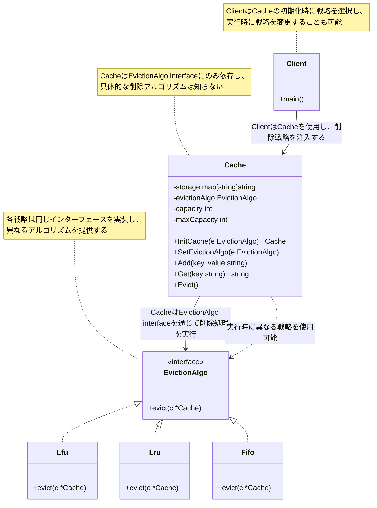
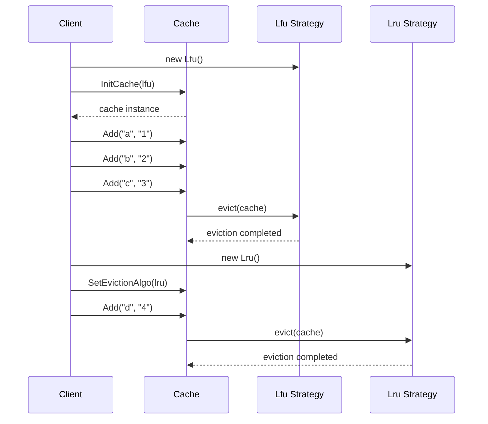

# Strategy パターン説明

## パターンの概要

Strategy（ストラテジー）パターンは、アルゴリズムを別々のクラスに分離し、実行時にアルゴリズムを選択できるようにする行動パターンです。  
このパターンにより、クライアントコードはアルゴリズムの詳細を知ることなく、インターフェースを通じて異なる戦略を使い分けることができます。

## パターンのポイント
- ContextはStrategyのみを呼び出し、具体的なアルゴリズムの実装は知らない
- Strategyによって提供されるメソッドはinterfaceによって抽象化されている
- 実行時にStrategyを切り替えることができる

## このサンプルの構造

このサンプルでは、キャッシュの削除アルゴリズム（Eviction Algorithm）を題材にしたStrategy パターンの実装を行っています。

### 主要コンポーネント

1. **Strategy Interface（戦略インターフェース）**: `EvictionAlgo`
2. **Concrete Strategies（具体的戦略）**: `Lfu`, `Lru`, `Fifo`
3. **Context（コンテキスト）**: `Cache`
4. **Client**: `main`関数

## クラス図



## シーケンス図



## 実装の詳細

### 1. Strategy Interface（EvictionAlgo インターフェース）

```go
type EvictionAlgo interface {
    evict(c *Cache)
}
```

### 2. Context（Cache 構造体）

```go 
type Cache struct {
    storage        map[string]string
    evictionAlgo   EvictionAlgo
    capacity       int
    maxCapacity    int
}
```

Cacheは削除戦略を保持し、容量が上限に達した際に戦略に従って削除を実行します。  
SetEvictionAlgoメソッドにより、実行時に戦略を変更することも可能です。

### 3. Concrete Strategies（具体的戦略）

- **Lfu (Least Frequently Used)**: 最も使用頻度の低いアイテムを削除
- **Lru (Least Recently Used)**: 最も最近使用されていないアイテムを削除  
- **Fifo (First In First Out)**: 最初に追加されたアイテムを削除

現在の実装では、各戦略は削除メッセージを出力するシンプルな実装になっています。

### 4. Context Operations（Cacheの操作）

```go
func (c *Cache) Add(key, value string) {
    if c.capacity == c.maxCapacity {
        c.Evict()  // 戦略に従って削除
    }
    c.capacity++
    c.storage[key] = value
}

func (c *Cache) Evict() {
    c.evictionAlgo.evict(c)  // 戦略インターフェースを呼び出し
    c.capacity--
}
```

## パターンの利点

1. **アルゴリズムの交換性**: 実行時に戦略を切り替え可能
2. **開放/閉鎖原則**: 新しい戦略の追加が既存コードに影響しない
3. **単一責任原則**: 各戦略が単一のアルゴリズムに専念
4. **テスト容易性**: 各戦略を個別にテスト可能
5. **コードの重複排除**: 共通のインターフェースで統一

## Strategyパターンが真価を発揮する場面

### 小規模な例での制限

小規模なケースでは、Strategyパターンの恩恵は分かりにくいかもしれません

```go
// 小規模なら条件分岐でも大差ない
func evict(strategy string, cache *Cache) {
    switch strategy {
    case "lfu":
        // LFU logic
    case "lru":
        // LRU logic
    case "fifo":
        // FIFO logic
    }
}
```

### より現実的な場面での価値

#### **1. 設定による戦略選択**

```go
// config.json
{
    "cacheStrategy": "lru",
    "environment": "production",
    "performanceMode": "high"
}

// 設定ベースでの戦略選択
func createCacheFromConfig() *Cache {
    config := loadConfig()
    
    var strategy EvictionAlgo
    switch config.CacheStrategy {
    case "lfu":
        strategy = &Lfu{}
    case "lru":
        strategy = &Lru{}
    case "fifo":
        strategy = &Fifo{}
    default:
        strategy = &Lru{} // デフォルト戦略
    }
    
    return InitCache(strategy)
}
```

#### **2. 実行時の動的戦略変更**

```go
// パフォーマンス監視による自動戦略切り替え
type AdaptiveCache struct {
    *Cache
    hitRatio      float64
    missCount     int
    strategySwitchThreshold float64
}

func (ac *AdaptiveCache) monitorAndAdapt() {
    if ac.hitRatio < ac.strategySwitchThreshold {
        // ヒット率が低い場合は戦略を変更
        if _, ok := ac.evictionAlgo.(*Lru); ok {
            ac.SetEvictionAlgo(&Lfu{})
            log.Info("Switched to LFU strategy due to low hit ratio")
        } else {
            ac.SetEvictionAlgo(&Lru{})
            log.Info("Switched to LRU strategy")
        }
    }
}

// 時間帯による戦略変更
func (ac *AdaptiveCache) scheduleStrategyChange() {
    ticker := time.NewTicker(1 * time.Hour)
    go func() {
        for range ticker.C {
            hour := time.Now().Hour()
            switch {
            case hour >= 9 && hour <= 17: // 営業時間
                ac.SetEvictionAlgo(&Lru{}) // アクセスパターン重視
            case hour >= 18 && hour <= 23: // 夜間
                ac.SetEvictionAlgo(&Lfu{}) // 頻度重視  
            default: // 深夜・早朝
                ac.SetEvictionAlgo(&Fifo{}) // シンプルな処理
            }
        }
    }()
}
```

#### **3. 複雑な戦略実装**

```go
// より高度なLRU実装
type AdvancedLru struct {
    accessHistory map[string]time.Time
    mu           sync.RWMutex
}

func (a *AdvancedLru) evict(c *Cache) {
    a.mu.Lock()
    defer a.mu.Unlock()
    
    var oldestKey string
    var oldestTime time.Time = time.Now()
    
    // 最も古いアクセス時刻のキーを検索
    for key, accessTime := range a.accessHistory {
        if accessTime.Before(oldestTime) {
            oldestTime = accessTime
            oldestKey = key
        }
    }
    
    if oldestKey != "" {
        delete(c.storage, oldestKey)
        delete(a.accessHistory, oldestKey)
        log.Printf("Evicted %s (last accessed: %v)", oldestKey, oldestTime)
    }
}

func (a *AdvancedLru) recordAccess(key string) {
    a.mu.Lock()
    defer a.mu.Unlock()
    a.accessHistory[key] = time.Now()
}

// 重み付きLFU実装
type WeightedLfu struct {
    frequency map[string]int
    weights   map[string]float64
    mu        sync.RWMutex
}

func (w *WeightedLfu) evict(c *Cache) {
    w.mu.Lock()
    defer w.mu.Unlock()
    
    var targetKey string
    var lowestScore float64 = math.MaxFloat64
    
    // 頻度と重みを考慮したスコア計算
    for key, freq := range w.frequency {
        weight := w.weights[key]
        score := float64(freq) * weight
        
        if score < lowestScore {
            lowestScore = score
            targetKey = key
        }
    }
    
    if targetKey != "" {
        delete(c.storage, targetKey)
        delete(w.frequency, targetKey)
        delete(w.weights, targetKey)
        log.Printf("Evicted %s (score: %.2f)", targetKey, lowestScore)
    }
}
```

#### **4. A/Bテストでの戦略比較**

```go
// A/Bテスト用の戦略切り替え
type ABTestCache struct {
    cacheA *Cache  // 戦略A
    cacheB *Cache  // 戦略B
    ratio  float64 // A/B振り分け比率
}

func (ab *ABTestCache) Get(key string) string {
    // ユーザーIDのハッシュで振り分け
    if ab.shouldUseA(key) {
        value := ab.cacheA.Get(key)
        ab.recordMetrics("strategyA", "hit", value != "")
        return value
    } else {
        value := ab.cacheB.Get(key)
        ab.recordMetrics("strategyB", "hit", value != "")
        return value
    }
}

func (ab *ABTestCache) shouldUseA(key string) bool {
    hash := hashString(key)
    return (hash % 100) < int(ab.ratio * 100)
}
```

#### **5. マルチレベルキャッシュでの戦略組み合わせ**

```go
// L1, L2キャッシュで異なる戦略を使用
type MultiLevelCache struct {
    l1Cache *Cache  // 高速・小容量（LRU）
    l2Cache *Cache  // 低速・大容量（LFU）
    l3Cache *Cache  // 永続化・巨大（FIFO）
}

func (m *MultiLevelCache) Get(key string) string {
    // L1から順番に検索
    if value := m.l1Cache.Get(key); value != "" {
        return value
    }
    
    if value := m.l2Cache.Get(key); value != "" {
        // L2にヒットした場合はL1に昇格
        m.l1Cache.Add(key, value)
        return value
    }
    
    if value := m.l3Cache.Get(key); value != "" {
        // L3にヒットした場合はL2とL1に昇格
        m.l2Cache.Add(key, value)
        m.l1Cache.Add(key, value)
        return value
    }
    
    return ""
}
```

### 結論

小規模なサンプルでは確かに**オーバーエンジニアリング**になりがちですが、以下の場合にStrategyパターンの真価が発揮されます：

1. **実行時の戦略切り替え**: 条件や設定に応じた動的な戦略変更
2. **複雑なアルゴリズム**: 各戦略が複雑で、分離したい場合
3. **A/Bテスト**: 異なる戦略の性能比較
4. **拡張性**: 頻繁に新しい戦略が追加される予定
5. **設定駆動**: 設定ファイルによる戦略選択

**シンプルな条件分岐で十分な場合は無理にパターンを使わず**、**複雑になったときにリファクタリングでStrategy導入**というアプローチが実践的です！
